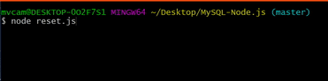
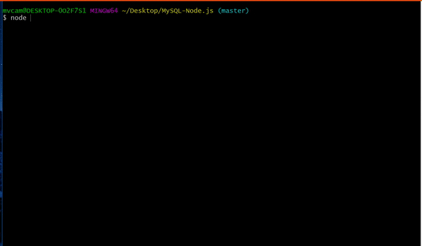
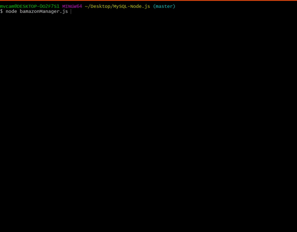
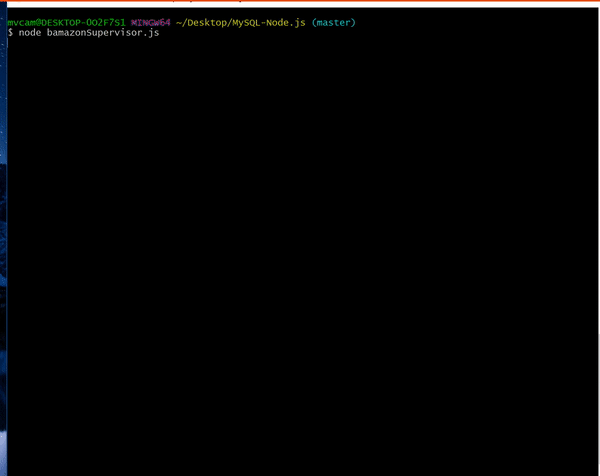

# Bamazon Node APP with MySQL

## What this app will imitate:
    This application will imitate the information transactions that are modern online shopping.
    You will be able to access the customer, managerial, and supervisor levels of these transactions.

## How to begin:


##### First off, you will need to run <br>
```
npm install
```
This installs all of the packages I used to create this application.<br>

##### These include: 

1. **Mysql npm**, which allows for the interaction with mysql databases.
2. **Inquirer npm**, which gives the ability to ask and receive input from the user.
3. **Table npm**, which takes data from mysql and other areas and places them into pretty tables.
4. **Clear npm**, which clears the terminal.

##### Secondly, you will need to make sure you have a MySQL connection which has the configs of: 
    host: localhost,
    user: root,
    password: "your password"

You are going to have to update my files with your password.
##### The places you need to do this are at the top of the pages:

    - bamazonCustomer.js
    - bamazonManager.js
    - bamazonSupervisor.js
    - reset.js

#### But what do these files do, Michael?
#### Chill out, I am not there yet, [insert your name here]

## What these files do: 
#### Happy [insert your name here] ?

### Reset.js

Reset.js will use sql files I have added to create a bamazon database with my intial products and departments

## Do Not Use IF You Want To Keep Your Current Bamazon Database!!!!
This file will drop your current bamazon database from the connection. If you already have a bamazon database, you are more than welcome to use it. You will have to go in and make the tables yourself, but you will be able to follow in the sql files how I set them up.
If you do not have a bamazon database or do not care what happens to your bamazon database, running this in your command line will save you some time in setting up the database.

```
node reset.js
```



Once you have run the file, you will be all set to start using bamazon!

### bamazonCustomer.js

```
node bamazonCustomer.js
```

This is the customer level of the online shopping experience. You will be presented a table which holds all of the items for sale in the Bamazon online store. You can enter in the desired item ID to begin the process of purchasing the item.



### bamazonManager.js

```
node bamazonManager.js
```

This is the manager level of the online shopping experience. You will be able to select from the menu different options that a Bamazon manger has at his/her disposal. You can view the store's products that are for sale. Target items that are at low inventory for closer expection. You can order more inventory as well as add entire new products to existing departments. How Fun!



### bamazonSupervisor.js

```
node bamazonSupervisor.js
```

This is the Supervisor level of the online shopping experience. Supervisors can keep track of how departments in the Bamazon store are doing. They can sort the information based on department ID, department total sales, or department overhead costs. Finally the Bamazon supervisor can add entirely new departments.



